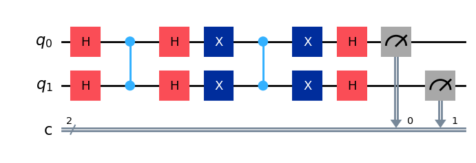
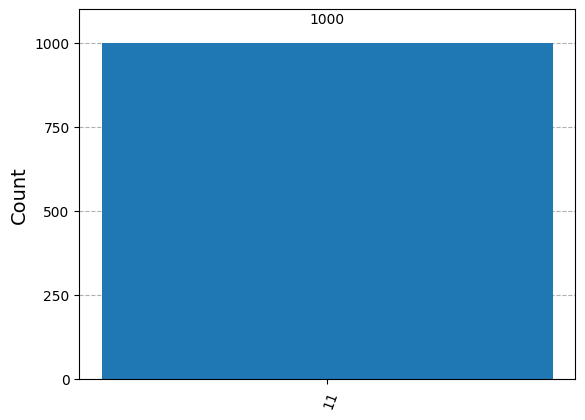

# Grover's Algorithm Implementation using Qiskit

This project implements Grover's algorithm using Qiskit to solve unstructured search problems. The algorithm provides a quadratic speedup over classical search algorithms.

## Theory
Grover's algorithm consists of the following steps:
1. Initialize qubits in superposition.
2. Apply an oracle to mark the solution state(s).
3. Apply a diffusion operator to amplify the probability amplitude of the solution state(s).
4. Repeat the oracle and diffusion steps approximately \(\sqrt{N}\) times.
5. Measure the qubits to obtain the solution.

## Implementation
- **Oracle**: Marks the state \(|11>rangle\) in a 2-qubit system.
- **Diffusion Operator**: Reflects amplitudes about the average.
- **Quantum Circuit**: Built using Qiskit and simulated using the QASM simulator.

## Results
The measurement results show a high probability of measuring the state \(|11\rangle\), demonstrating the success of Grover's algorithm.

## Visualization
Circuit:

Histogram:

## Efficiency Comparison
- Classical search: \(O(N)\)
- Grover's search: \(O(\sqrt{N})\)
